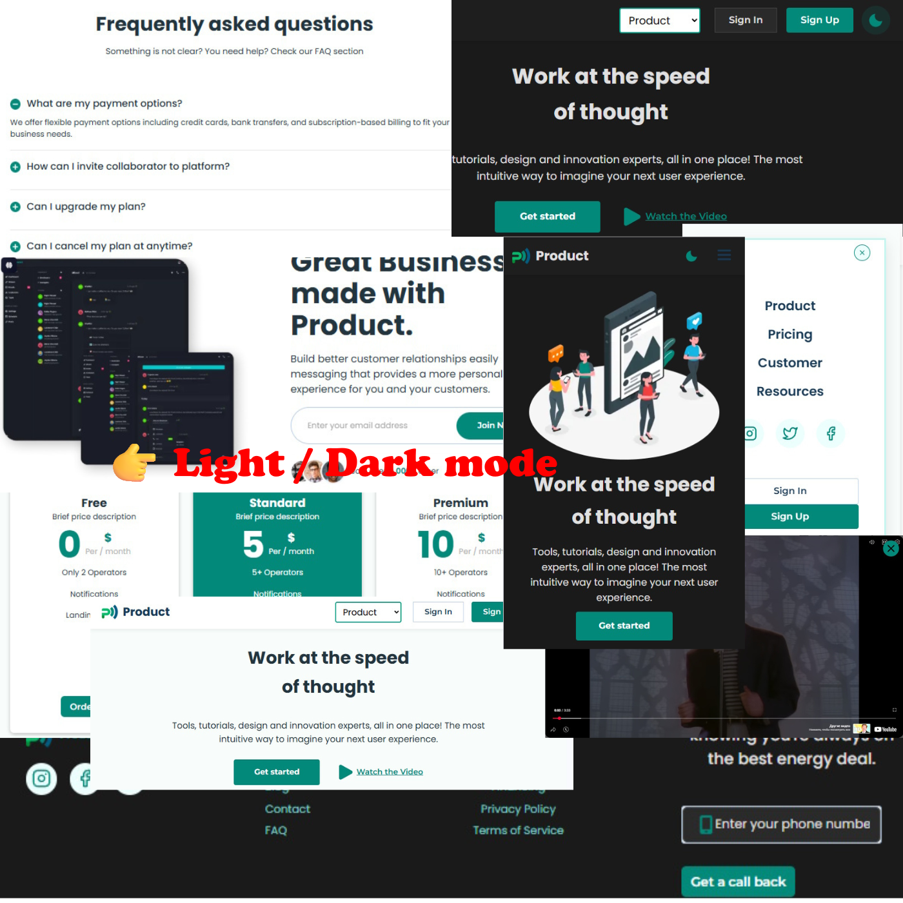

<p align="center">
  
</p>

# ⭐ Business-promotion-Vite-Alexander

Современный адаптивный лендинг с переключением светлой и тёмной темы,
выполненный на чистом **HTML / CSS / JS**.  
Проект создан как учебный и демонстрирует работу темизации интерфейса без
сторонних библиотек.

---

## 🔗 Ссылки проекта

🌍 **Live Demo**  
https://bashmachok1982.github.io/Business-promotion-Vite-Alexander/

📂 **Репозиторий проекта**  
https://github.com/Bashmachok1982/Business-promotion-Vite-Alexander

---

## ✨ Основные возможности

- 🌗 переключение Light / Dark mode
- 🎯 адаптивная верстка (мобильные устройства + десктоп)
- 🧭 фиксированное меню навигации
- 🧩 карточки тарифов (Pricing)
- ❓ блок FAQ (аккордеон вопросов-ответов)
- 🧑‍💻 Hero-секция с CTA-кнопками
- 🪄 плавные hover-эффекты и анимации
- 💾 сохранение выбранной темы в LocalStorage

---

## 🛠️ Технологии

- HTML5
- CSS3 (Flexbox / Grid)
- JavaScript (Vanilla JS)
- LocalStorage

---

## ⚙️ Как это работает

- при клике на 🌙/☀️ переключается тема
- текущая тема сохраняется в LocalStorage
- при перезагрузке сайта тема автоматически восстанавливается
- стили элементов меняются динамически
- адаптивность реализована через media-queries

---

## 🚀 Как запустить проект локально

```bash
git clone https://github.com/Bashmachok1982/Business-promotion-Vite-Alexander
cd Business-promotion-Vite-Alexander
Открыть файл:

diff
Копировать код
index.html
или запустить через Live Server.

🙌 Что здесь делалось
сверстан лендинг по макету

сделана адаптация под мобильные устройства

реализовано переключение светлой/тёмной темы

проработана структура секций

добавлены интерактивные элементы и модальные окна

оформлены анимации и стили

📣 Автор
Александр Адинцов
💬 открыт к отзывам и предложениям
```
